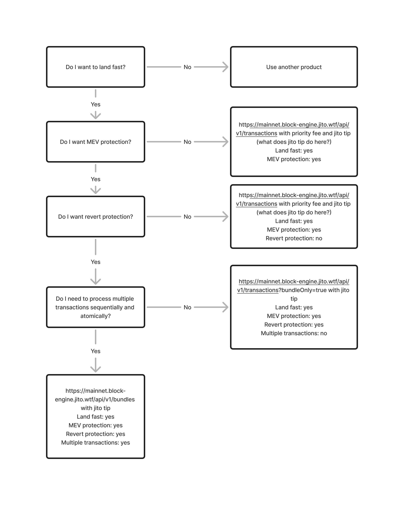

# Low Latency Transaction Send

Jito provides Solana MEV users with superior transaction execution through fast landing, MEV protection, and revert protection, available for both single transactions and multiple transactions(bundles) via gRPC and JSON-RPC services, ensuring optimal performance in the highly competitive Solana ecosystem."

